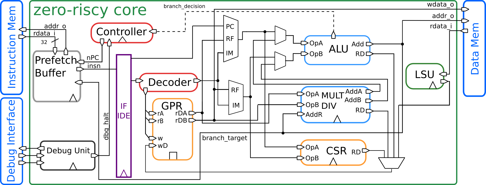

Introduction
============

   Block Diagram

ZERO-RISCY is a 2-stage in-order 32b RISC-V processor core. ZERO-RISCY has been designed to be small and efficient. Via two parameters, the core is configurable to support four ISA configurations. :numref:`blockdiagram` shows a block diagram of the core.

Supported Instruction Set
-------------------------

ZERO-RISCY supports the following instructions:

* Full support for RV32I Base Integer Instruction Set
* Full support for RV32E Base Integer Instruction Set
* Full support for RV32C Standard Extension for Compressed Instructions
* Full support for RV32M  Integer Multiplication and Division Instruction Set Extension

The RV32M and RV32E can be enable and disable using two parameters.

ASIC Synthesis
--------------

ASIC synthesis is supported for ZERO-RISCY. The whole design is completely synchronous and uses positive-edge triggered flip-flops, except for the register file, which can be implemented either with latches or with flip-flops. See Chapter 4 for more details about the register file. The core occupies an area of about 18.9 kGE when the latch based register file and the RV32IMC ISA is used or 11.6 kGE when the RV32EC is used .

FPGA Synthesis
--------------

FPGA synthesis is supported for ZERO-RISCY when the flip-flop based register file is used. Since latches are not well supported on FPGAs, it is crucial to select the flip-flop based register file.

Outline
-------

This document summarizes all the functionality of the ZERO-RISCY core in more detail. First, the instruction and data interfaces are explained in :ref:`instruction-fetch` and :ref:`load-store-unit`. :ref:`register-file` explains the register file. Control and status registers are explained in :ref:`cs-registers` and Chapter :ref:`performance-counters` gives an overview of all performance counters. Chapter :ref:`exceptions-interrupts` deals with exceptions and interrupts, and finally Chapter :ref:`debug-unit` summarizes the accessible debug registers.
