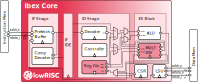

Introduction
============

   Block Diagram

Ibex is a 2-stage in-order 32b RISC-V processor core.
Ibex has been designed to be small and efficient.
Via two parameters, the core is configurable to support four ISA configurations.
:numref:`blockdiagram` shows a block diagram of the core.

Supported Instruction Set
-------------------------

Ibex supports the following instruction sets and extensions:

* Full support for RV32I Base Integer Instruction Set
* Full support for RV32E Base Integer Instruction Set
* Full support for RV32C Standard Extension for Compressed Instructions
* Full support for RV32M Integer Multiplication and Division Instruction Set Extension

Support for RV32M and RV32E can be enabled or disabled using two separate configuration parameters.

ASIC Synthesis
--------------

ASIC synthesis is supported for Ibex.
The whole design is completely synchronous and uses positive-edge triggered flip-flops, except for the register file, which can be implemented either with latches or with flip-flops.
See :ref:`register-file` for more details.
The core occupies an area of roughly 18.9 kGE when using the latch-based register file and implementing the RV32IMC ISA, or 11.6 kGE when implementing the RV32EC ISA.

FPGA Synthesis
--------------

FPGA synthesis is supported for Ibex when the flip-flop based register file is used.
Since latches are not well supported on FPGAs, it is crucial to select the flip-flop based register file.

Contents
--------

:ref:`core-integration` provides the instantiation template and gives descriptions of the design parameters as well as the input and output ports.
The instruction and data interfaces of Ibex are explained in :ref:`instruction-fetch` and :ref:`load-store-unit`, respectively.
The two register-file flavors are described in :ref:`register-file`.
The control and status registers are explained in :ref:`cs-registers`.
:ref:`performance-counters` gives an overview of the performance monitors and event counters available in Ibex.
:ref:`exceptions-interrupts` deals with the infrastructure for handling exceptions and interrupts,
:ref:`debug-support` gives a brief overview on the debug infrastructure.
For information regarding formal verification support, check out :ref:`rvfi`.

History
-------

Ibex development started in 2015 under the name "Zero-riscy" as part of the `PULP platform <https://pulp-platform.org>`_ for energy-efficient computing.
Much of the code was developed by simplifying the RV32 CPU core "RI5CY" to demonstrate how small a RISC-V CPU core could actually be `[1] <https://doi.org/10.1109/PATMOS.2017.8106976>`_.
To make it even smaller, support for the "E" exension was added under the code name "Micro-riscy".
In the PULP ecosystem, the core is used as the control core for PULP, PULPino and PULPissimo.

In December 2018 lowRISC took over the development of Zero-riscy and renamed it to Ibex.

References
----------

1. `Schiavone, Pasquale Davide, et al. "Slow and steady wins the race? A comparison of ultra-low-power RISC-V cores for Internet-of-Things applications." 27th International Symposium on Power and Timing Modeling, Optimization and Simulation (PATMOS 2017) <https://doi.org/10.1109/PATMOS.2017.8106976>`_
