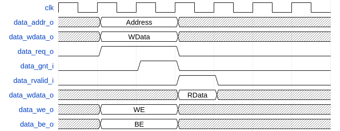
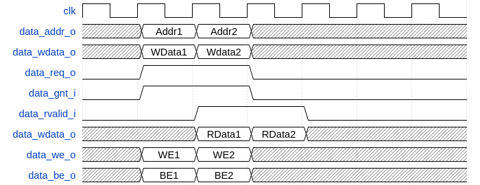
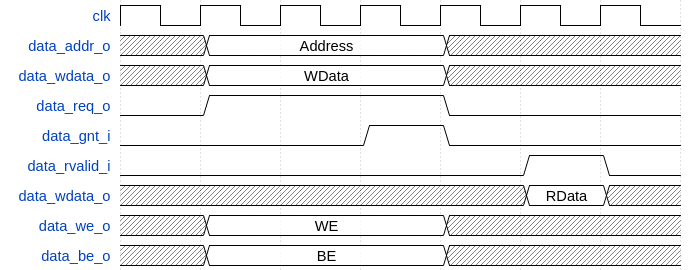

.. _load-store-unit:

Load-Store-Unit (LSU)
=====================

The LSU of the core takes care of accessing the data memory. Load and stores on words (32 bit), half words (16 bit) and bytes (8 bit) are supported.

Signals that are used by the LSU:

+-------------------------+-----------+-----------------------------------------------+
| Signal                  | Direction | Description                                   |
+=========================+===========+===============================================+
| ``data_req_o``          | output    | Request ready, must stay high until           |
|                         |           | ``data_gnt_i`` is high for one cycle          |
+-------------------------+-----------+-----------------------------------------------+
| ``data_addr_o[31:0]``   | output    | Address                                       |
+-------------------------+-----------+-----------------------------------------------+
| ``data_we_o``           | output    | Write Enable, high for writes, low for        |
|                         |           | reads. Sent together with ``data_req_o``      |
+-------------------------+-----------+-----------------------------------------------+
| ``data_be_o[3:0]``      | output    | Byte Enable. Is set for the bytes to          |
|                         |           | write/read, sent together with ``data_req_o`` |
+-------------------------+-----------+-----------------------------------------------+
| ``data_wdata_o[31:0]``  | output    | Data to be written to memory, sent together   |
|                         |           | with ``data_req_o``                           |
+-------------------------+-----------+-----------------------------------------------+
| ``data_rdata_i[31:0]``  | input     | Data read from memory                         |
+-------------------------+-----------+-----------------------------------------------+
| ``data_rvalid_i``       | input     | ``data_rdata_is`` holds valid data when       |
|                         |           | ``data_rvalid_i`` is high. This signal will   |
|                         |           | be high for exactly one cycle per request.    |
+-------------------------+-----------+-----------------------------------------------+
| ``data_gnt_i``          | input     | The other side accepted the request.          |
|                         |           | ``data_addr_o`` may change in the next cycle  |
+-------------------------+-----------+-----------------------------------------------+

Misaligned Accesses
-------------------

The LSU is able to perform misaligned accesses, meaning accesses that are not aligned on natural word boundaries. However, it needs to perform two separate word-aligned accesses internally. This means that at least two cycles are needed for misaligned loads and stores.

.. _lsu-protocol:

Protocol
--------

The protocol that is used by the LSU to communicate with a memory works as follows:

The LSU provides a valid address in ``data_addr_o`` and sets ``data_req_o`` high. The memory then answers with a ``data_gnt_i`` set high as soon as it is ready to serve the request. This may happen in the same cycle as the request was sent or any number of cycles later. After a grant was received, the address may be changed in the next cycle by the LSU. In addition, the ``data_wdata_o``, ``data_we_o`` and ``data_be_o`` signals may be changed as it is assumed that the memory has already processed and stored that information. After receiving a grant, the memory answers with a ``data_rvalid_i`` set high if ``data_rdata_i`` is valid. This may happen one or more cycles after the grant has been received. Note that ``data_rvalid_i`` must also be set when a write was performed, although the ``data_rdata_i`` has no meaning in this case.

:numref:`timing1`, :numref:`timing2` and :numref:`timing3` show example-timing diagrams of the protocol.

   Basic Memory Transaction

   Back-to-back Memory Transaction

   Slow Response Memory Transaction
