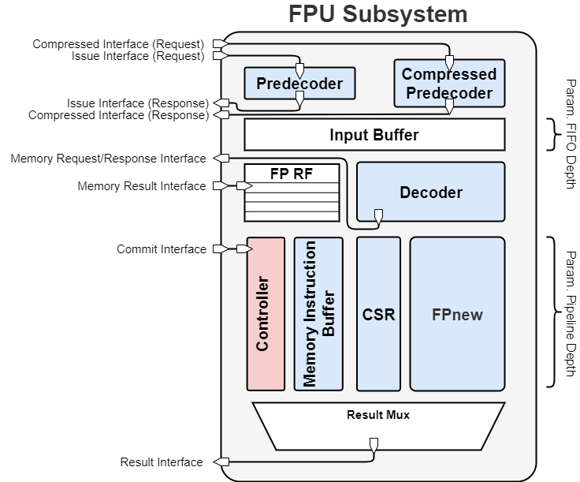

# Floating-Point Unit Subsystem
The Floating-Point Unit Subsystem is a 32-bit coprocessor that implements the RISC-V "F" Standard Extension, Version 2.1 and the RISC-V "Zfinx" Standard Extension, Version 1.0.0-rc. The coprocessor implements all channels described by the [Core-V eXtension Interface (cv-x-if)](https://github.com/openhwgroup/core-v-xif) to communicate with a core. The [FPnew](https://github.com/pulp-platform/fpnew) serves as the processing unit inside the coprocessor.
The implementation is taylored to cv32e40p (formerly known as RI5CY). This means exception handling is not implemented, since there are no memory exceptions in cv32e40p.
## Integration
The coprocessors main module is named `fpu_ss` and can be found in [fpu_ss.sv](src/fpu_ss.sv "fpu_ss.sv"). Below, the instantiation template is given and the parameters are described.
### Integration Template
	fpu_ss #(
	    .PULP_ZFINX           ( 0 ),
	    .INPUT_BUFFER_DEPTH   ( 0 ),
	    .OUT_OF_ORDER         ( 1 ),
	    .FORWARDING           ( 1 ),
	    .FPU_FEATURES         (   ),
	    .FPU_IMPLEMENTATION   (   )
	) fpu_ss_i (
	    // clock and reset
	    .clk_i                (),
	    .rst_ni               (),

	    // Compressed Interface
	    .x_compressed_valid_i (),
	    .x_compressed_ready_o (),
	    .x_compressed_req_i   (),
	    .x_compressed_resp_o  (),

	    // Issue Interface
	    .x_issue_valid_i      (),
	    .x_issue_ready_o      (),
	    .x_issue_req_i        (),
	    .x_issue_resp_o       (),

	    // Commit Interface
	    .x_commit_valid_i     (),
	    .x_commit_i           (),

	    // Memory Request/Response Interface
	    .x_mem_valid_o        (),
	    .x_mem_ready_i        (),
	    .x_mem_req_o          (),
	    .x_mem_resp_i         (),

	    // Memory Result Interface
	    .x_mem_result_valid_i (),
	    .x_mem_result_i       (),

	    // Result Interface
	    .x_result_valid_o     (),
	    .x_result_ready_i     (),
	    .x_result_o           ()
	);

### Dependencies
The [FPnew](https://github.com/pulp-platform/fpnew) is a submodule of the floating-point unit subsystem. Use

	git submodule update --init --recursive
to load the FPnew or use

	git clone --recurse-submodules https://github.com/moimfeld/fpu_ss
to clone the repository with the Fpnew.
### Parameters

| Parameter Name       | Values                                                                                          | Description                                  | Default |
| -------------------- | ----------------------------------------------------------------------------------------------- | -------------------------------------------- | ------- |
| `PULP_ZFINX`         | {0,1}                                                                                           | Use F or zfinx extension                     | 0       |
| `INPUT_BUFFER_DEPTH` | {0, ... , 2^32-1}                                                                               | Input buffer depth                           | 0       |
| `OUT_OF_ORDER`       | {0, 1}                                                                                          | Enabling out-of-order execution              | 1       |
| `FORWARDING`         | {0, 1}                                                                                          | Enabling forwarding inside the fpu subsystem | 1       |
| `FPU_FEATURES`       | see [FPnew](https://github.com/pulp-platform/fpnew/tree/develop/docs/README.md#parameters) docs | -                                            | -       |
| `FPU_IMPLEMENTATION` | see [FPnew](https://github.com/pulp-platform/fpnew/tree/develop/docs/README.md#parameters) docs | -                                            | -       |

#### Extended parameter descriptions
##### `PULP_ZFINX`
When `PULP_ZFINX` is set to `1`, the coprocessor supports the "Zfinx" extension and no longer supports the "F" extension. No floating-point specific register file will be instantiated, which will reduce the area of the coprocessor. Using the "Zfinx" extension is likely to have a negative impact on IPC.

**Important Note**: If the coprocessor wants to be simulated/compiled for the "Zfinx" extension then `PULP_ZFINX_DEF` must be defined (besides setting `PULP_ZFINX` to `1`).
##### `INPUT_BUFFER_DEPTH`
Setting `INPUT_BUFFER_DEPTH` to `0` will remove the FIFO that buffers incoming instructions from the core. This can have a negative impact on IPC, but will reduce the area of the coprocessor.
##### `FORWARDING`
Setting `FORWARDING` to `0` removes the possibility of forwarding operands from the output of the FPnew to the input of the FPnew. This will significantly reduce the area of the coprocessor and increase the maximum frequency, but can have a negative effect on the IPC.

# Architecture
This section describes the architecture of the coprocessor. The following figure gives a high level overview of the coprocessor.

### List of Modules
| Name                           | Description                                                                                                                                                                                       | SystemVerilog File                                                                                             |
| ------------------------------ | ------------------------------------------------------------------------------------------------------------------------------------------------------------------------------------------------- | -------------------------------------------------------------------------------------------------------------- |
| `fpu_ss`                       | Top level module                                                                                                                                                                                  | [fpu_ss.sv](src/fpu_ss.sv "fpu_ss.sv")                                                                         |
| `fpu_ss_compressed_predecoder` | Expands valid floating-point compressed instructions and sends them back to the core via the compressed interface                                                                                 | [fpu_ss_compressed_predecoder.sv](src/fpu_ss_compressed_predecoder.sv "fpu_ss_compressed_predecoder.sv")       |
| `fpu_ss_predecoder`            | Decides when and if an offload attempt from the core is accepted or not                                                                                                                           | [fpu_ss_predecoder.sv](src/fpu_ss_predecoder.sv "fpu_ss_predecoder.sv")                                        |
| `stream_fifo`                  | Stream FIFO from [pulp-platform/common_cells](https://github.com/pulp-platform/common_cells) is used in the coprocessor to buffer incoming instructions and metadata of ongoing memory operations | [stream_fifo.sv](https://github.com/pulp-platform/common_cells/tree/master/src/stream_fifo.sv "stream_fifo.sv")|
| `fpu_ss_decoder`               | Decodes instructions                                                                                                                                                                              | [fpu_ss_decoder.sv](src/fpu_ss_decoder.sv "fpu_ss_decoder.sv")                                                 |
| `fpu_ss_regfile`               | Flip-flop based floating-point specific register file with three read ports and one write port                                                                                                    | [fpu_ss_regfile.sv](src/fpu_ss_regfile.sv "fpu_ss_regfile.sv")                                                 |
| `fpnew_top`                    | Main porcessing unit                                                                                                                                                                              | [fpnew_top.sv](https://github.com/pulp-platform/fpnew/tree/develop/src/fpnew_top.sv "fpnew_top.sv")            |
| `fpu_ss_csr`                   | Contains the floating-point specific CSR registers and executes all floating-point specific CSR instructions                                                                                      | [fpu_ss_csr.sv](src/fpu_ss_csr.sv "fpu_ss_csr.sv")                                                             |
| `fpu_ss_controller`            | Control unit for the whole subsystem and the cv-x-if                                                                                                                                              | [fpu_ss_controller.sv](src/fpu_ss_controller.sv "fpu_ss_controller.sv")                                        |
#### Extended Module Descriptions
##### `fpu_ss_compressed_predecoder`
The compressed predecoder takes any instruction sequence that was offloaded via the compressed interface (see [cv-x-if documentation](https://docs.openhwgroup.org/projects/openhw-group-core-v-xif/x_ext.html#compressed-interface)).  If the sequence corresponds to a valid floating-point instruction it will expand the instruction and send it back to the core via the compressed interface.
##### `fpu_ss_predecoder`
The predecoder decides if the coprocessor can accept the instruction the core is currently trying to offload. It also assigns predetermined values to the issue interface response signals once a valid instruction is encountered. These predetermined values are defined in the predecoder packages (`fpu_ss_prd_f_pkg` and `fpu_ss_prd_zfinx_pkg`).
##### `input_stream_fifo`
The `input_stream_fifo` is used to buffer offloaded instruction. If the parameter `INPUT_BUFFER_DEPTH` is set to 0, no input buffer is instantiated. The buffer stores the instruction, the source operands, the id of the offloaded instruction and the mode of the offloaded instruction. The `input_stream_fifo` operates in fall-through mode, i.e. if it is empty, every data-element that is input into it will be visible at the output in the same clock cycle. It works in this mode to reduce latency.

### List of Packages
| Name                   | Description                                                                                      | SystemVerilog File                                                               |
| ---------------------- | ------------------------------------------------------------------------------------------------ | -------------------------------------------------------------------------------- |
| `fpu_ss_pkg`           | Defines coprocessor specific structs, cv-x-if structs and the FPnew configuration/implementation | [fpu_ss_pkg.sv](src/fpu_ss_pkg.sv "fpu_ss_pkg.sv")                               |
| `fpu_ss_instr_pkg`     | Instruction masks for the fpu_ss_decoder                                                         | [fpu_ss_instr_pkg.sv](src/fpu_ss_instr_pkg.sv "fpu_ss_instr_pkg.sv")             |
| `fpu_ss_prd_f_pkg`     | "F" Standard Extension package for the predecoder                                                | [fpu_ss_prd_f_pkg.sv](src/fpu_ss_prd_f_pkg.sv "fpu_ss_prd_f_pkg.sv")             |
| `fpu_ss_prd_zfinx_pkg` | "Zfinx" Standard Extension package for the predecoder                                            | [fpu_ss_prd_zfinx_pkg.sv](src/fpu_ss_prd_zfinx_pkg.sv "fpu_ss_prd_zfinx_pkg.sv") |
#### Extended Package Descriptions
##### `fpu_ss_prd_f_pkg` and `fpu_ss_prd_zfinx_pkg`
These packages contain the parameters for the predecoder and define which instructions will be accepted by the fpu_ss. Each instruction has its predefined issue interface response. If `PULP_ZFINX_DEF` is defined the predecoder is instantiated with the parameters in the `fpu_ss_prd_zfinx_pkg`. If `PULP_ZFINX_DEF` is not defined the predecoder is instantated with the parameters in the `fpu_ss_prd_f_pkg`.